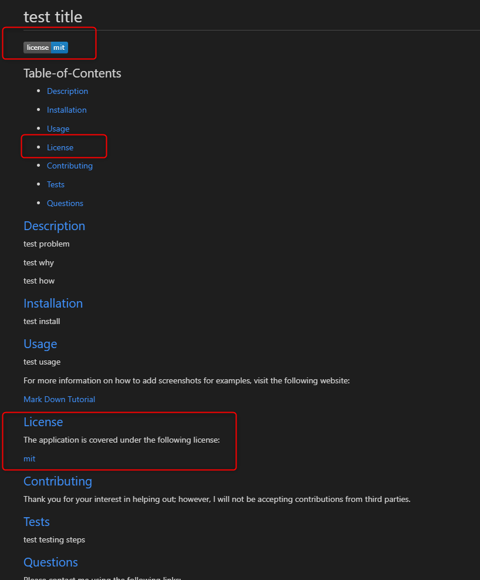

# Professional-README-Generator
  
   

  ## Table-of-Contents

  * [Description](#description)
  * [Installation](#installation)
  * [Usage](#usage)
   
  * [Contributing](#contributing)
  * [Tests](#tests)
  * [Questions](#questions)
  
  ## [Description](#table-of-contents)

  My project is a README generator. The project will help a user generate a README without having to worry about applying proper mark down syntax.

  One problem with most projects is that the README is overlooked. This could be because the developer is lazy and doesn't want to include it or they haven't mastered down the proper syntax to creating a README. Also they possibly don't have a good idea of what to include with the README.

  This README generator will allow the user to answer a series of specific questions and create a professional complete README based on their responses. It will take a couple minutes and provide the developer with the ability to make their project complete and more professional, increasing the likely hood that someone will want to use their app over similar apps without a README.

  ## [Installation](#table-of-contents)

  Click the repository link below. Download the zip file and copy it to a directory of your choice or clone to a directory of your choice using your terminal.  Open the file in VS Code or whatever editor you work with. Open the terminal in VS Code and make sure you’re in the root directory ‘challenge-9-professional-README-generator. You’ll now be ready to run the app!

  [README Generator Download Link](https://github.com/mjgiannelli/challenge-9-professional-README-generator/)

  [ZIP file download Tutorial](https://drive.google.com/file/d/1Es77aULk006BU_krKsyRvkA5YwO5_yvE/view)

  [Git Clone download Tutorial](https://drive.google.com/file/d/1i-yD756_Ibe_SUFfAvNI3cTmBkNMfbiq/view)

  [Tutorial on how to use app](https://drive.google.com/file/d/1D2fBbKYpz3s7xbjWTj9DZnJrpr12AgbM/view)
  
  README Screenshot No License
  
  
  README Screenshot with License
  
    

  ## [Questions](#table-of-contents)

  Please contact me using the following links:

  [GitHub](https://github.com/MackOyler)

  [Email: mackoyler@gmail.com](mailto:mackoyler@gmail.com)